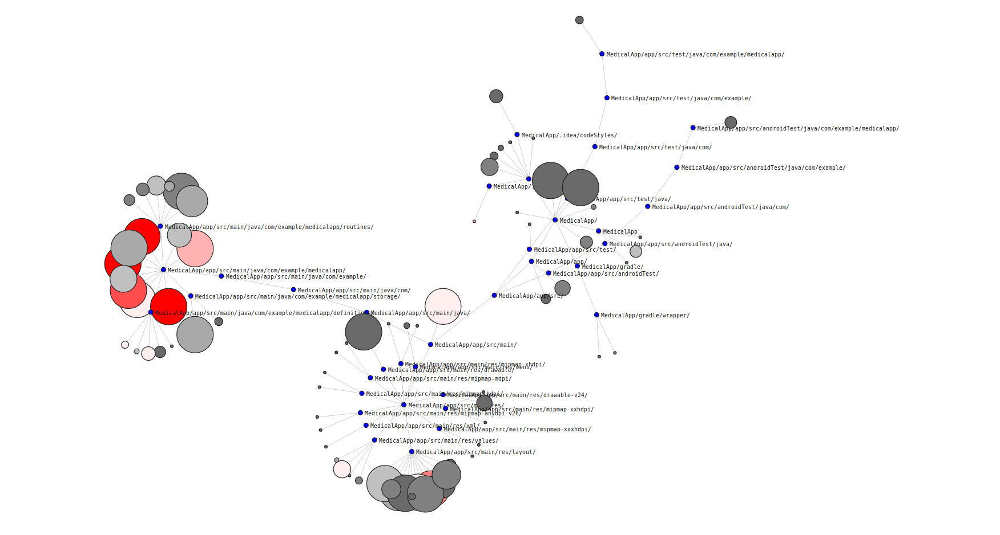

# GitHub API REST requests
Using **Python** to retrieve data from the Github API and displaying this data into nice visualisations using the **d3.js** library.

# Information Displayed
The entire page is visible through either DataDisplay/repo_map.html or https://matthew-d-ng.github.io/repo_map.html

The webpage reads data from https://matthew-d-ng.github.io/files.json
and https://matthew-d-ng.github.io/links.json

The information being displayed at current is from a private repo with 99 total commits. If you want to read a different file you'll have to change it manually in the html file.

If you can't see anything, try scrolling down and to the right.

The visualisation displays a graph with several nodes, representing files within a repository, whose size corresponds to the amount of lines within them. The colour of the nodes displays their "heat", i.e the amount of commits that have affected them. 

So basically: bigger nodes are bigger files. Redder nodes are "busier" files. Dark grey nodes have not really been touched. Light grey / white / light pink nodes are in the middle.

Directories are displayed in blue, along with their path. File paths of individual files can be viewed by hovering over them with the mouse. Hovering will also dim nodes not connected to the hovered one, so that visual clutter is reduced and you can focus on it.

Clicking a node will open up further information about that file, including: exact number of commits, it's overall code churn, and the code churn of each contributor in respect to that particular file.

The window is very big, because for very big repos things need a lot of space, and I actually thought being able to scroll was preferable. Nodes can be dragged around to help you navigate any possible clutter.

# Information Retrieval

From the DataRetrieval Directory, json will be written into "../DataDisplay/files.json" and "../DataDisplay/links.json".

grab_hotspots_main.py makes calls to grabHotspots.py and json_write.py.
Running this will result in being requested for login, password and a repo name in the form 'user/repo' to github. Without logging in, you'll hit a rate limit fast. The program doesn't have any functionality for tokens.

